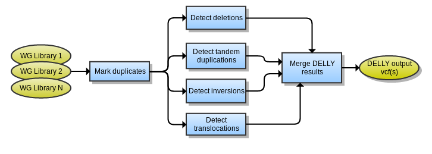

## Overview

Delly workflow produces a set of vcf files with different types of structural variant calls: Translocation, Deletion, Inversion and Duplications
It uses .bam files as input. The below graph describes the process:



## Preprocessing

The expected inputs for the DELLY tool are library-level BAMs with distinct insert size and median. In most cases, this means that the BAM files will not need to be merged prior to processing. However, the DELLY website recommends the removal of non-unique, multi-mapped reads and marking duplicate reads. We may also have to realign around indels and perform base recalibration.

### Mark duplicates

Picard Tools MarkDuplicates is used to flag reads as PCR or optical duplicates.
```
 java -jar MarkDuplicates.jar
 INPUT=sample.bam
 OUTPUT=sample.dedup.bam    
 METRICS_FILE=sample.metrics
```

### Detect deletions
```
delly
-t DEL
-x excludeList.tsv
-o sample.jumpy.bam
-q 0
-g hn19.fa
sample.bam
```
 
### Detect tandem duplications
```
delly
-t DUP
-x excludeList.tsv
-o sample.jumpy.bam
-q 0
-g hn19.fa
sample.bam
```
 
### Detect inversions
```
delly
-t INV
-x excludeList.tsv
-o sample.jumpy.bam
-q 0
-g hn19.fa
sample.bam
Detect translocations
```
### Detecting translocations
```
delly
-t TRA
-x excludeList.tsv
-o sample.jumpy.bam
-q 0
-g hn19.fa
sample.bam
```
### Post-processing
Each DELLY tool produces several files, which will all need to be merged together after the chromosomes are finished processing. The output format is described on the DELLY webpage. The merging script may require a small parser to combine the output from multiple runs in together.
Merge DELLY results with vcftools

### Workflow Inputs

Input | Type | Description
---|---|---
`outputFileNamePrefix`|String?|Output prefix to be used with result files, default = ""
`inputNormal`|File?|Normal input .bam file
`inputTumor`|File|Tumor input .bam file
`markdup`|Boolean|A switch between marking duplicate reads and indexing with picard, default = true
`dupmarkBam.timeout`|Int|Timeout in hours, default = 20
`dupmarkBam.modules`|String?|Modules to be used with mark duplicate step
`dupmarkBam.jobMemory`|Int|Job memory in Gb, default = 20
`runDelly.timeout`|Int|Timeout in hours, default = 20
`runDelly.modules`|String?|Modules to be used with runDelly call
`runDelly.refFasta`|String?|Path to reference fasta
`runDelly.jobMemory`|Int|Job memory in Gb, default = 16
`runDelly.mappingQuality|Int|mapping quality filter, default = 30
`runDelly.excludeList|String|Path to a reference-specific file with coordinates of telomeric and centromeric regions
`mergeAndZipALL.prefix`|String?|Prefix to use with merge/zip step, should not be changed under the norrmal circumstances, default = ""
`mergeAndZipALL.jobMemory`|Int|Job memory in Gb, default = 10
`mergeAndZipALL.modules`|String?|Modules to be used with mergeAndZip call
`mergeAndZipFiltered.jobMemory`|Int|Job memory in Gb, default = 10
`mergeAndZipFiltered.modules`|String?|Modules to be used with mergeAndZip call

### Provisioned outputs
Each delly run produces two types of outputs - combined vcf with all structural variants with a tabix index and a filtered subset of the same variants.

Output | Type | Description
---|---|---
`mergedVcf`|File?|vcf file containing all structural variant calls
`mergedIndex`|File?|tabix index of the vcf file containing all structural variant calls
`mergedFilteredVcf`|File?|filtered vcf file containing all structural variant calls
`mergedFilteredIndex`|File?|tabix index of the filtered vcf file containing all structural variant calls

## Niassa + Cromwell

This WDL workflow is wrapped in a Niassa workflow (https://github.com/oicr-gsi/pipedev/tree/master/pipedev-niassa-cromwell-workflow) so that it can used with the Niassa metadata tracking system (https://github.com/oicr-gsi/niassa).

* Building
```
mvn clean install
```

* Testing
```
mvn clean verify \
-Djava_opts="-Xmx1g -XX:+UseG1GC -XX:+UseStringDeduplication" \
-DrunTestThreads=2 \
-DskipITs=false \
-DskipRunITs=false \
-DworkingDirectory=/path/to/tmp/ \
-DschedulingHost=niassa_oozie_host \
-DwebserviceUrl=http://niassa-url:8080 \
-DwebserviceUser=niassa_user \
-DwebservicePassword=niassa_user_password \
-Dcromwell-host=http://cromwell-url:8000
```

## Support

For support, please file an issue on the [Github project](https://github.com/oicr-gsi) or send an email to gsi@oicr.on.ca.
